# Diagrams

Visual representations of govman's architecture and workflows.

## System Overview

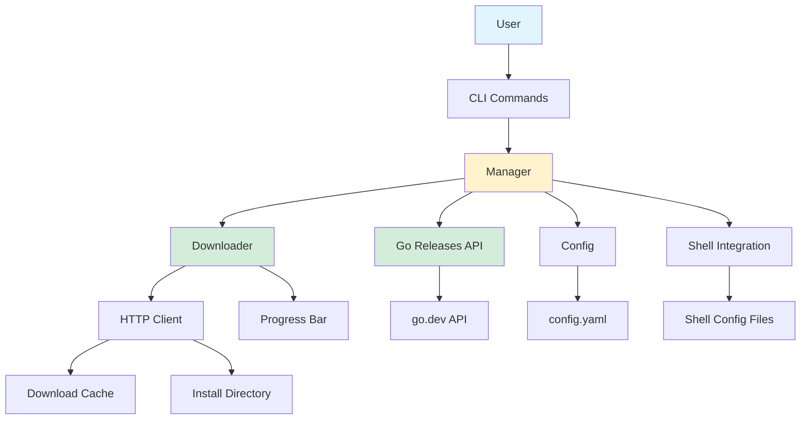

## Installation Workflow

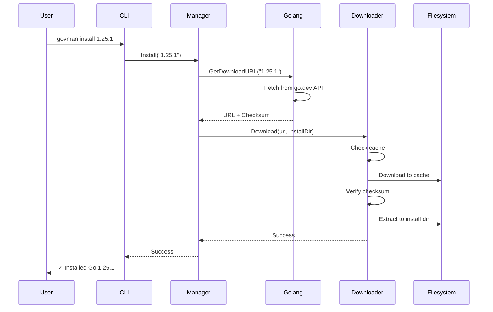

## Version Switching Workflow

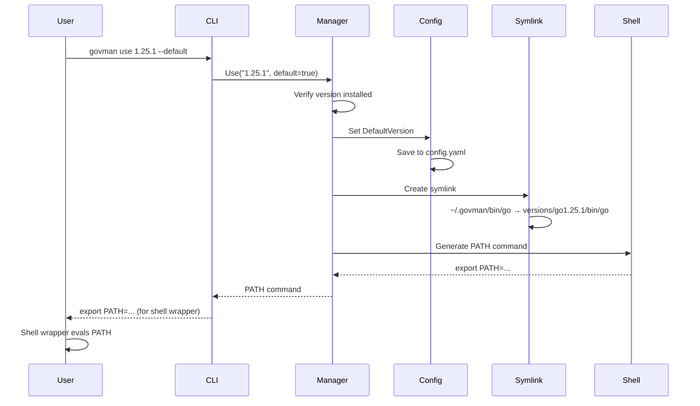

## Auto-Switch Workflow

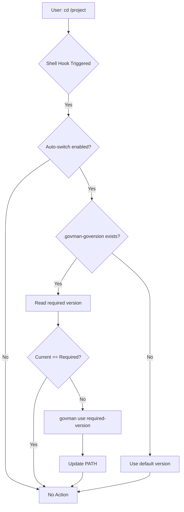

## Component Dependencies

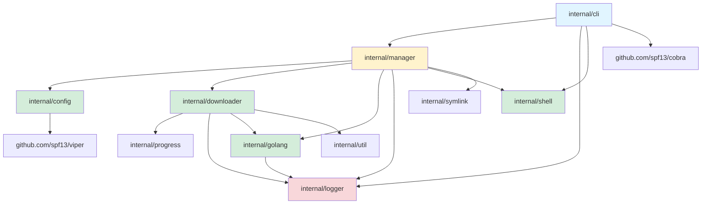

## File System Organization

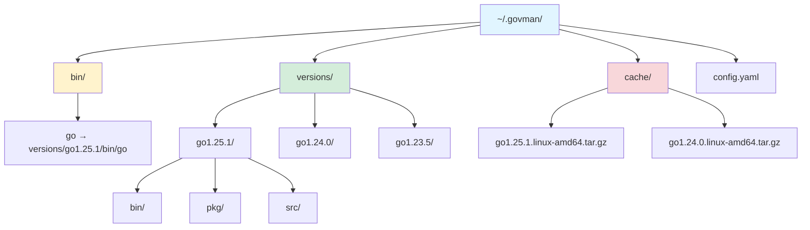

## State Machine: Version Activation

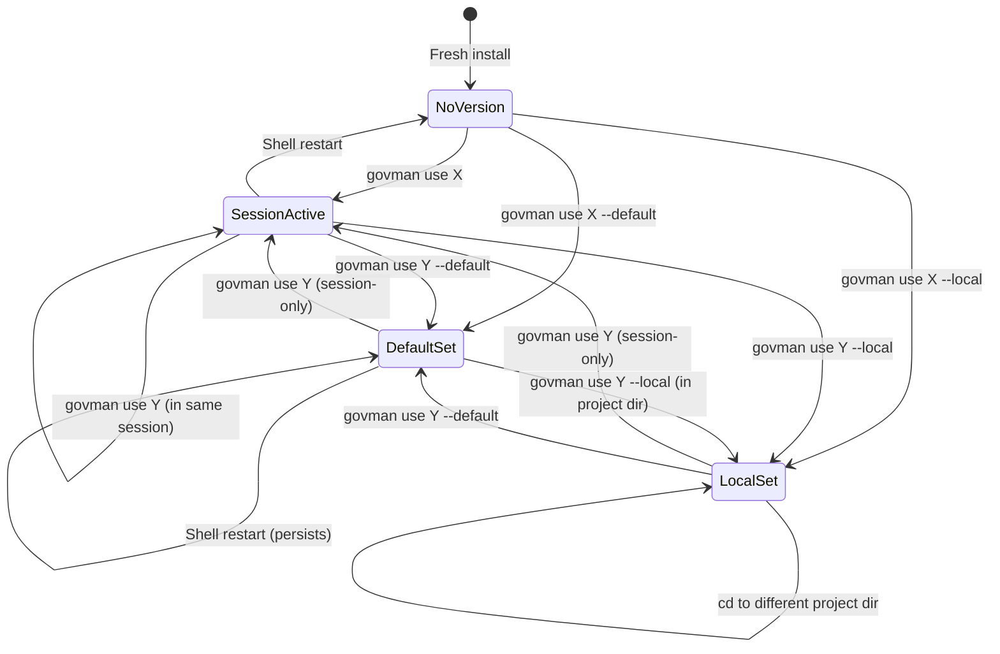

## Download Flow

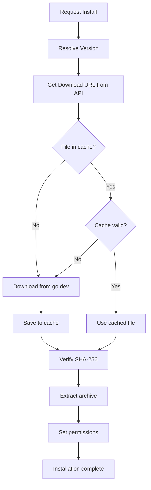

## Shell Integration Architecture

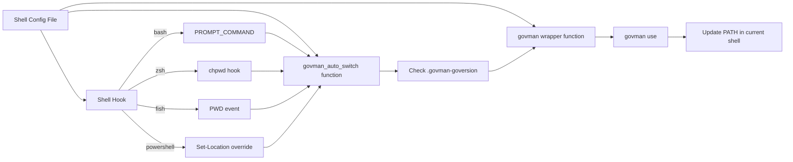

## Error Handling Flow

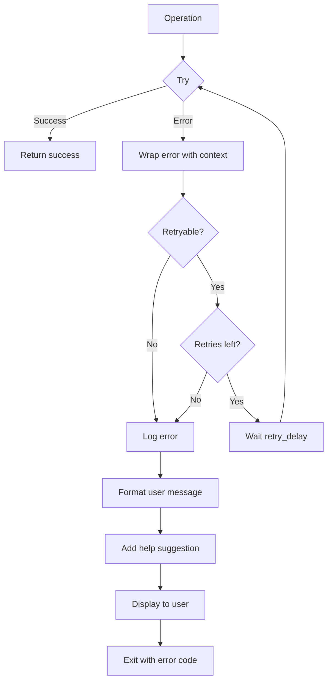

## Release and Self-Update

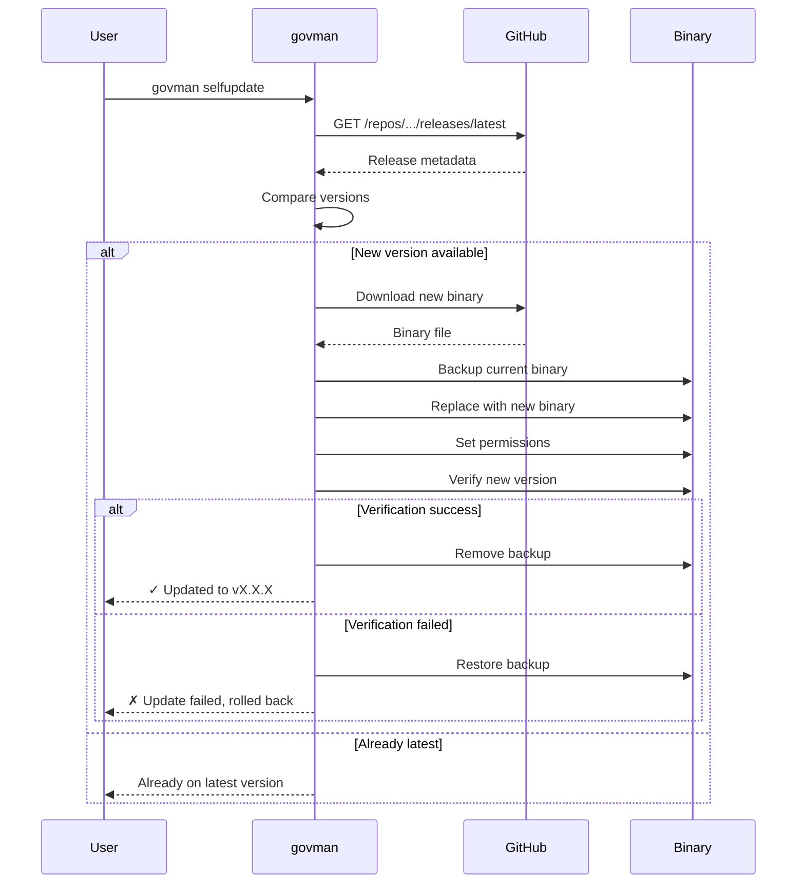

## Platform-Specific Binary Selection

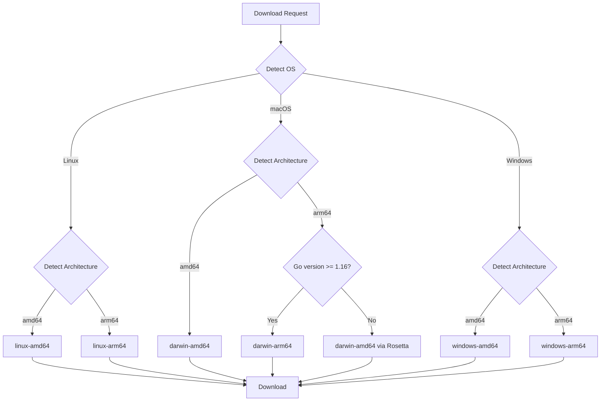

## Configuration Loading Sequence

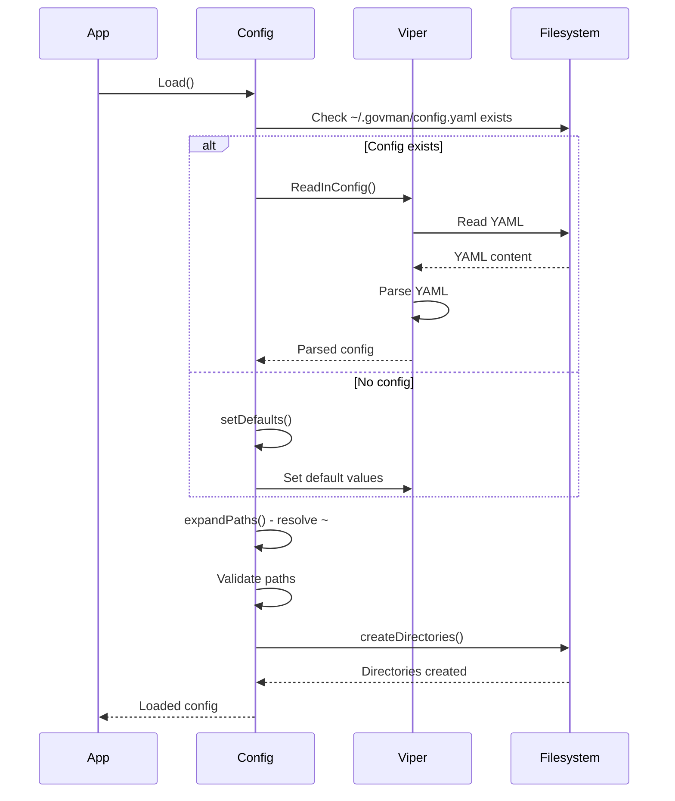
